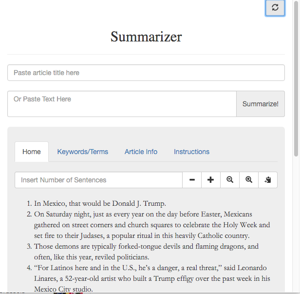
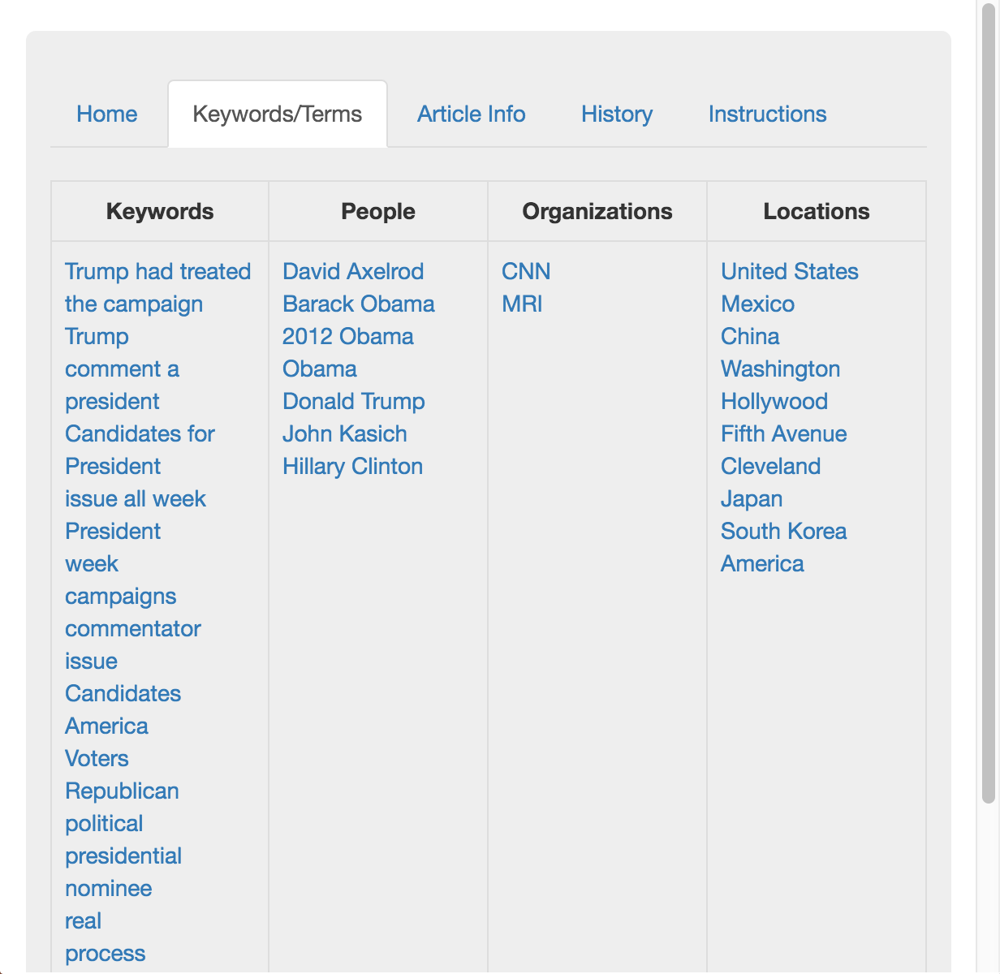
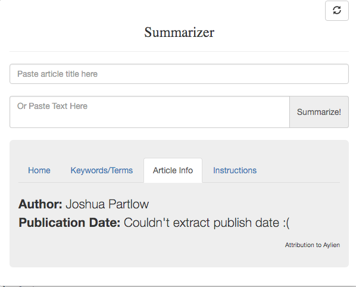
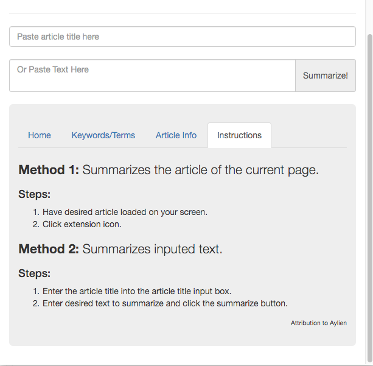
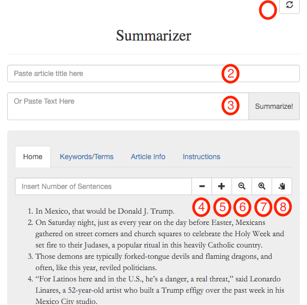
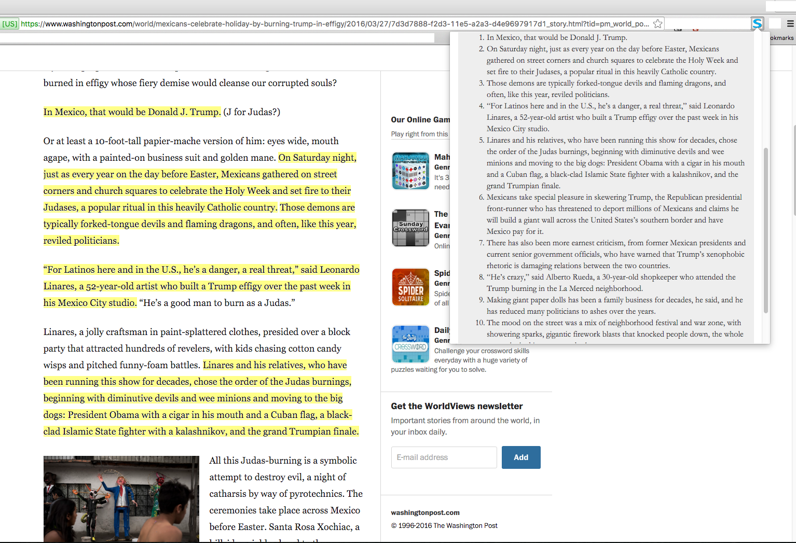

# Capital One Article Summarization Challenge
This project is a google chrome extension that summarizes online articles.
This extension uses Aylien Text API to summarize online articles and extract key information from the article. 

#Install
In order to use this exension you need to first install node.js https://nodejs.org/en/download/  
After installing node.js enter these into the command line:  
1) Get repository:  

$ git -clone https://github.com/bchung1/Capital-One-Challenge.git  

2) Open the folder "Capital-One-Challenge" and install local dependencies: aylien_textapi  

$ npm install  

3) Install global dependencies: browserify and watchify  

$ npm install -g browserify watchify  

#Usage
In order to use this extension all you need is your own ID and key from Aylien Text API.  
Steps:  

1) Sign up here https://developer.aylien.com/signup and get 1,000 calls a day for free.  
2) Open the repository and open popup.js which is in the js folder. At the very top there are two variables ID and key. Assign to those variables your key and ID.  
3) Now we have to update the bundle.js file using browserify.js which is a tool for compiling node-flavored commons modules for the browser.  
4) To update bundle.js with the new key and ID, enter:  

$ sudo browserify popup.js -o bundle.js  

5) Finally, load the extension into chrome.  

#Extension Features

  
This is the default layout which summarizes the current page in 10 sentences    

  
This page provides a table of keywords and phrases categorized by keywords, people, organizations, and locations   

  
This page attempts to extract the authors name and publication date of the article   

   
This page lists the methods of summarization   

  
1) This button resets the page to the default setting which is a summary of 10 sentences.  
2) This input field is for the title of the pasted text article.  
3) This text area is for the pasted text to summarize. Entering a title in addition to the text helps summarize the text, but is optional.  
4) This button decrements the number of sentences displayed by 1 sentence.  
5) This button increments the number of sentences displayed by 1 sentence.  
6) This button decreases the font size of the summary.  
7) This button increases the font size of the summary.   
8) This button copies the displayed summary onto the clipboard.  
9) This is input for the number of sentences to display for the summary.   

  

This is the bonus objective I added which highlights the summary sentences in the current browser page. I hoped that this feature would help readers easily identify where the summary sentences and its context in the article as whole.    

