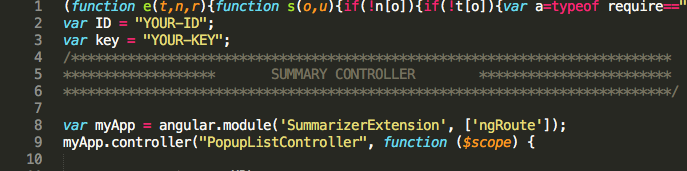

# Capital One Article Summarization Challenge
This project is a google chrome extension that summarizes online articles.
This extension uses Aylien Text API to summarize online articles and extract key information. It also uses chrome.storage to store articles and summarizes. 

#Install
Enter these into the command line:  
1) Get repository:  

$ git clone https://github.com/bchung1/Capital-One-Challenge.git  

2) Open the folder "Capital-One-Challenge" and install local dependencies: aylien_textapi  

$ npm install  

3) Install global dependencies: browserify and watchify (for development uses)  

$ sudo npm install -g browserify watchify  

#Usage
In order to use this extension you need your own ID and key from Aylien Text API.  
Steps:  

1) Sign up here https://developer.aylien.com/signup and get 1,000 calls a day for free.  
2) Open the repository and open bundle.js in the js folder. At the very top there are two variables ID and key. Assign to those variables your key and ID.  
   
3) Load the extension into chrome.  

#Extension Features

  
<h3>This page displays the summary of the current page.</h3>
1) This input changes the number of sentences of the summary.  
2) This button decreases the font size.  
3) This button increases the font size.  
4) This button copies the summary to the clipboard.  
5) This button resizes the browser to allow the user to read the summary and the article.  
6) This button saves the summary to chrome storage.  

  
<h3>My Bonus Objective</h3>
The bonus objective I added was to highlight the summary sentences and the keywords in the current browser page. I hoped that this feature would help readers quickly identify the summary sentences in the article. Some sentences need more context and this feature is a quick way to achieve this. To highlight the text, I used a jquery plugin by Johann Burkard. 

  
<h3>Summary Alternative</h3>
In case the extension cannot summarize the current page, the user has the option to paste the article title and text himself/herself.  

  
<h3>This page provides a table of keywords and phrases categorized by keywords, people, organizations, and locations. Each keyword/phrase links to a wikipedia page</h3>

  
<h3>This page displays the author and publication date of the article </h3>

 
<h3>History</h3>
This page displays all the saved summaries. The user can read the summary, original text, open article in new tab, remove the summary, or clear the history.  

   
<h3>This page is a very basic set of instructions for this extension.</h3>

